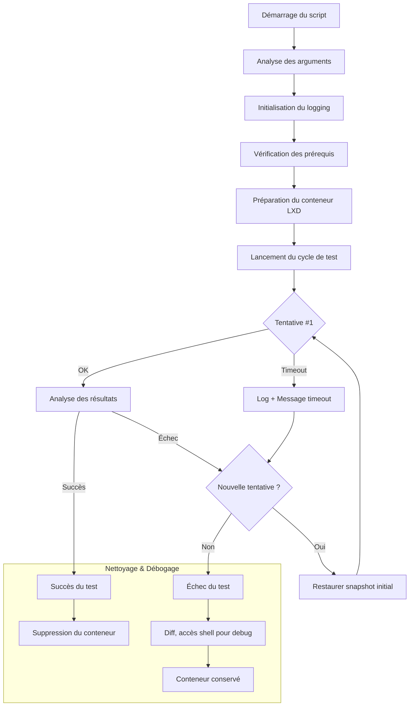

<div align="right">Projet par : <strong>Robin Coquery</strong></div>

# BashMill ⚙️


**BashMill** est un framework de test d'infrastructure léger et puissant, écrit en pur Bash. Il est conçu pour valider des scripts de configuration de serveurs Linux dans des environnements propres et jetables, en utilisant la puissance des conteneurs système LXD.

Le projet transforme le processus de test, souvent manuel et sujet aux erreurs, en une seule commande fiable, rapide et entièrement automatisée.

*Auteur : [sidix](https://github.com/sidix130)*

---

## 🏛️ Philosophie

Dans le monde du DevOps et du SRE, la confiance n'est pas une option. Chaque changement, même mineur, doit être validé. BashMill a été construit sur trois principes fondamentaux :

1.  **Confiance par l'Automatisation :** Éliminer les tests manuels pour garantir des résultats 100% reproductibles.
2.  **Diagnostic Rapide :** Un test qui échoue doit fournir un maximum d'informations pour un débogage quasi-instantané.
3.  **Légèreté et Contrôle :** Pas de dépendances lourdes. Un unique script Bash pour un contrôle total et une performance maximale.

---

## ✨ Fonctionnalités Clés

*   **Framework Générique :** Testez n'importe quel script shell via une simple ligne de commande (`--script-path`).
*   **Environnements Stériles :** Chaque test s'exécute dans un conteneur Debian 12 vierge, garantissant l'absence d'effets de bord.
*   **Cycle de Test Robuste :** Intègre des tentatives multiples, des timeouts et une capture fiable des codes d'erreur.
*   **Validation de Pertinence :** Vérifie la connectivité réseau via un test réel sur les dépôts APT avant de lancer le script.
*   **Diagnostic d'Échec Avancé :**
    *   En cas d'échec, le conteneur est **automatiquement conservé** dans son état final.
    *   Un **rapport `diff`** des modifications du système de fichiers est généré pour identifier immédiatement les changements effectués par le script.
*   **Mode Interactif :** Une option `--interactive` permet de conserver le conteneur même après un succès pour une inspection manuelle.

---

## ⚙️ Le Cycle du Moulin

Le processus est conçu pour être simple et impitoyable, comme un moulin traitant le grain.



---

## 🚀 Démarrage Rapide

### 📋 Prérequis

*   Un système Linux avec `LXD` installé et configuré.
*   Votre utilisateur doit faire partie du groupe `lxd`.
    ```bash
    # Pour vérifier
    groups $USER

    # Si besoin, pour ajouter l'utilisateur (déconnexion/reconnexion nécessaire après)
    sudo usermod -aG lxd $USER
    ```

### 📁 Structure des Fichiers

Le projet est composé de deux scripts principaux, que vous devriez placer dans un dossier `scripts/`.

```
BashMill/
├── scripts/
│   ├── TheGrain.sh  # <-- Votre script à tester (le grain)
│   └── TheMill.sh   # <-- Le framework BashMill (le moulin)
└── README.md
```

### 🛠️ Utilisation

#### Exemple de `TheGrain.sh`

Voici un exemple simple de script que vous pourriez tester. Notez qu'il doit afficher les motifs de succès attendus par `TheMill.sh`.

```bash
#!/usr/bin/env bash
set -e

echo "--- Début de la configuration du grain ---"

# Simule une tâche de configuration
echo "Configuration de l'environnement..."
sleep 2
echo "Environnement configuré."

# Simule une autre tâche
echo "Installation de Docker..."
sleep 1
echo "Docker et son écosystème sont prêts" # <-- Motif de succès n°1

echo "--- Finalisation ---"
echo "Installation terminée avec succès" # <-- Motif de succès n°2

exit 0
```

#### Lancer le Test

Rendez le harnais de test exécutable et lancez-le.

```bash
chmod +x scripts/TheMill.sh

# Lancer un test simple
./scripts/TheMill.sh --script-path ./scripts/TheGrain.sh

# Lancer un test en mode interactif pour inspecter le résultat
./scripts/TheMill.sh --script-path ./scripts/TheGrain.sh --interactive
```

Le script vous guidera à travers chaque étape. En cas d'échec, il vous donnera des instructions claires pour le débogage.

---

## 🤝 Contribuer

Ce projet est ouvert aux contributions ! Si vous avez des idées d'amélioration, des corrections de bugs ou de nouvelles fonctionnalités, n'hésitez pas à ouvrir une "Issue" ou une "Pull Request".

## 🗺️ Feuille de Route (Roadmap)

Quelques idées pour l'avenir :
*   [ ] Ajouter la prise en charge d'autres distributions (CentOS, Fedora) via un "driver" de détection.
*   [ ] Intégrer une phase de "tests de validation" (ex: `docker run hello-world`) après l'exécution du script.
*   [ ] Permettre de passer les "motifs de succès" en tant qu'arguments.

---

## 📜 Licence

Ce projet est distribué sous la **Licence Publique Générale GNU v3.0 (GPLv3)**.

Cela garantit que ce logiciel et toutes ses versions modifiées resteront à jamais libres. Toute œuvre dérivée distribuée doit également être sous licence GPLv3 et son code source doit être rendu accessible.

Voir le fichier `LICENSE` pour le texte juridique complet.
